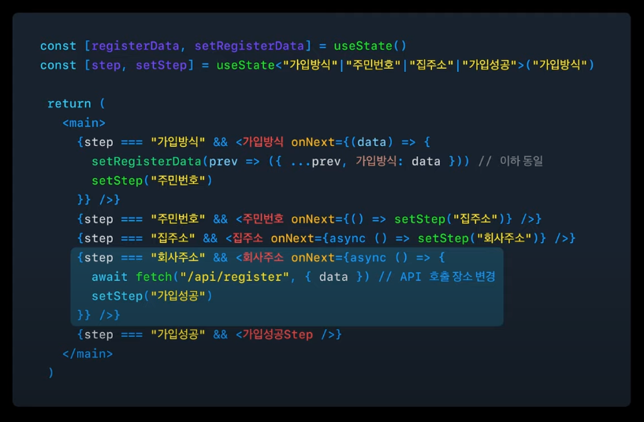

# 토스 SLASH 23 리뷰하기

토스 SLASH가 몇일 전에 열렸다. 코로나가 다 지난 마당에 갑자기 코로나에 걸리는 바람에 몇일동안 되게 아파서 아무것도 못했다. 지금에서야 간단하게 보고 적어보는 프론트엔드 발표영상들에서 인상깊었던 점들.

## 퍼널: 쏟아지는 페이지 한 방에 관리하기

설문조사와 같이 여러 페이지에 걸쳐 상태를 수집하고 결과 페이지를 보여주는 형태를 토스 내부에서 **퍼널**이라고 지칭한다고 한다. 그리고 토스 뱅크 가입과정에서 퍼널을 구현한 과정을 설명한다.

<figure><figcaption></figcaption></figure>

먼저 기존 퍼널은 다음과 같이 만들어져 있다. 최상위에서 registerData와 step 모두를 관리하고, 페이지를 현재 step에 따라서 조건부로 렌더링한다.

<figure><figcaption></figcaption></figure>

이러한 조건부 렌더링을 통해 위와 같이 간단히 추상화 할 수 있다.

<figure><figcaption></figcaption></figure>

또한 위와 같이 useFunnel이라는 훅을 통해 step 상태까지도 추상화해주면 아래와 같이 선언적으로 작성될 수 있다.

<figure><figcaption></figcaption></figure>

그리고 useFunnel에서 모든 step을 관리하기 때문에 router의 shallow push를 이용해서 앞뒤로가기를 구현하는것도 손쉽게 추가할 수 있었다.

<figure><figcaption></figcaption></figure>

## Server-driven UI로 토스의 마지막 어드민 만들기

Server-driven UI를 통해서 파편화되었던 어드민 개발을 통일하고 자동화한 과정을 공유한다. 검색해보니 Serverd-driven UI라는게 엄청나게 새로운 기술은 아닌 것 같지만 확실히 어드민 구현에 있어서 획기적인 방식일 수 있겠다는 생각이 많이 들었다.

아래는 의존성 주입을 통해 로직을 깔끔하게 분리한 사례

<figure><figcaption></figcaption></figure>

<figure><figcaption></figcaption></figure>

## 링크

[토스ㅣSLASH 23 - 퍼널: 쏟아지는 페이지 한 방에 관리하기](https://www.youtube.com/watch?v=NwLWX2RNVcw\&ab\_channel=%ED%86%A0%EC%8A%A4)

[토스ㅣSLASH 23 - Server-driven UI로 토스의 마지막 어드민 만들기](https://www.youtube.com/watch?v=3wxG1WLDONI\&ab\_channel=%ED%86%A0%EC%8A%A4)
